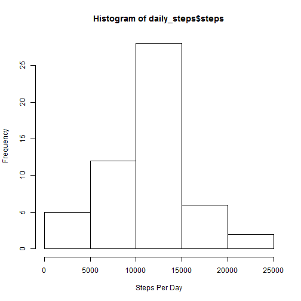
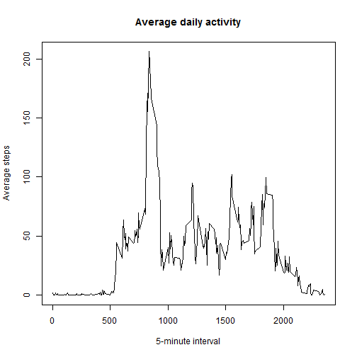
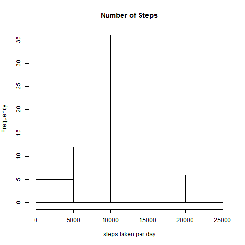

# Reproducible Research: Peer Assessment 1
#assume working directory contains .zip file
# Aug Class
##load libraries

```r
library(plyr)
```

```
## Warning: package 'plyr' was built under R version 3.0.3
```

```r
library(lattice)
```

```
## Warning: package 'lattice' was built under R version 3.0.3
```

## Loading and preprocessing the data

```r
unzip("activity.zip") 
data <- read.csv("activity.csv")
dataclean <- data[which(data$steps!= "NA"), ]
```


## What is mean total number of steps taken per day?

```r
daily_steps <- ddply(dataclean, .(date), summarise, steps=sum(steps))
hist(daily_steps$steps, xlab="Steps Per Day")
```

 

## Mean and Median 

```r
mean(daily_steps$steps)
```

```
## [1] 10766
```

```r
median(daily_steps$steps)
```

```
## [1] 10765
```


## What is the average daily activity pattern?

```r
average_date <- ddply(dataclean, .(interval), summarise, steps=mean(steps))
plot(average_date$interval, average_date$steps, type="l", xlab="5-minute interval", 
ylab="Average steps",main="Average daily activity")
```

 

## Which 5-minute interval, on average across all the days in the dataset, contains the maximum number of steps?

```r
average_date[average_date$steps==max(average_date$steps),]
```

```
##     interval steps
## 104      835 206.2
```

```r
colnames(average_date)[2] <- "intervalAvg"
```

## Inputing missing values

```r
#  calculate the missing values
sum(is.na(data$steps))
```

```
## [1] 2304
```

```r
# Replace NA's with the average of the 5 minute inverval
merged <- arrange(join(data, average_date), interval)
```

```
## Joining by: interval
```

```r
merged$steps[is.na(merged$steps)] <- merged$intervalAvg[is.na(merged$steps)]
# plot the histogram
#Difference in New Total Steps Per day is very simliar to original
new_daily_steps <- ddply(merged, .(date), summarise, steps=sum(steps))
hist(new_daily_steps$steps, main="Number of Steps", 
     xlab="steps taken per day",,)
```

 

```r
# Mean and Median After Replacing NA's are very simliar to original
mean(new_daily_steps$steps)
```

```
## [1] 10766
```

```r
median(new_daily_steps$steps)
```

```
## [1] 10766
```

```r
daily_steps_1 <- sum(dataclean$steps)
daily_steps_2 <- sum(merged$steps)
```

## Are there differences in activity patterns between weekdays and weekends?

```r
weekdays <- weekdays(as.Date(merged$date))
data_weekdays <- transform(merged, day=weekdays)
data_weekdays$wk <- ifelse(data_weekdays$day %in% c("Saturday", "Sunday"),"weekend", "weekday")
average_week <- ddply(data_weekdays, .(interval, wk), summarise, steps=mean(steps))
xyplot(steps ~ interval | wk, data = average_week, layout = c(1, 2), type="l")
```

 
